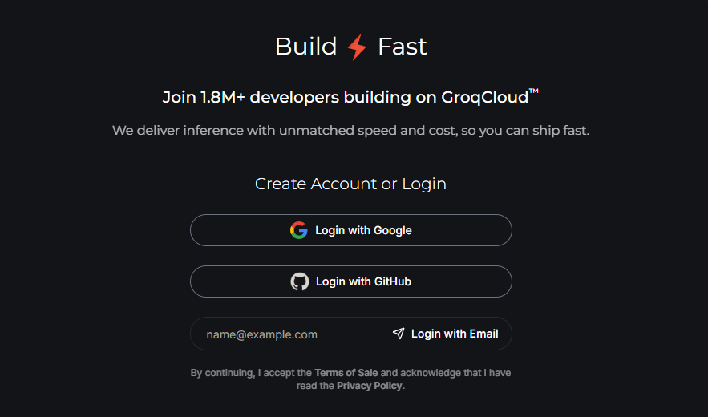
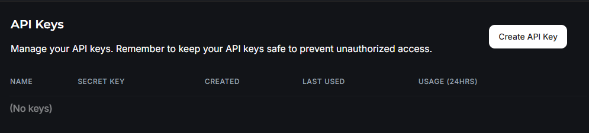
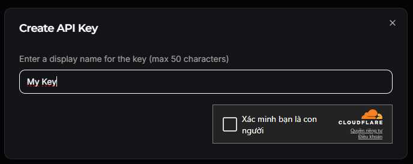
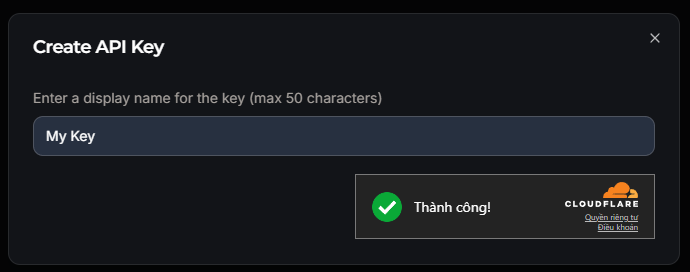
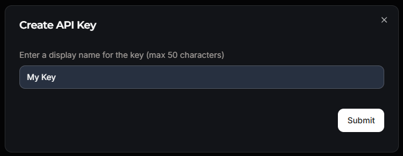
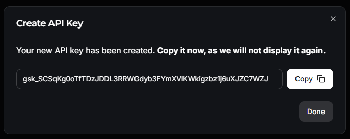
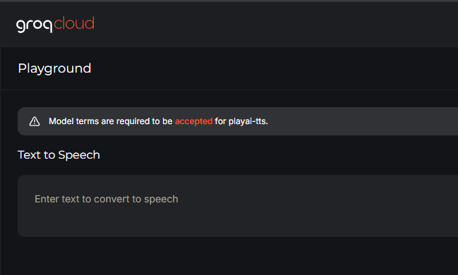
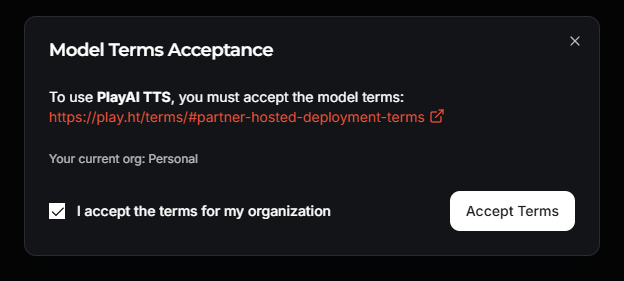

# Hướng dẫn tạo KEY để sử dụng tiện ích KimiZK-Translate

## 1. Đăng ký hoặc đăng nhập tài khoản

-   Truy cập [GroqCloud Console](https://console.groq.com/home).
-   Chọn đăng nhập bằng Google, GitHub hoặc Email.

s

## 2. Tạo API Key

-   Vào [API Keys](https://console.groq.com/keys).
-   Nhấn **Create API Key**.
-   Đặt tên cho key (tối đa 50 ký tự), xác thực CAPTCHA nếu có, rồi nhấn **Submit**.
-   Sao chép API Key hiển thị và lưu lại. Key chỉ xuất hiện một lần duy nhất.

> **Lưu ý:**  
> Hãy lưu giữ API Key cẩn thận. Nếu mất, bạn cần tạo lại key mới.

**Các bước thực hiện:**

-   
-   
-   
-   
-   

## 3. Chấp nhận điều khoản sử dụng tính năng voice

-   Truy cập [Playground - PlayAI TTS](https://console.groq.com/playground?model=playai-tts).
-   Khi xuất hiện thông báo yêu cầu chấp nhận điều khoản, nhấn **Accepted**, sau đó nó hiện ra bảng thông báo giữa màn
    hình thì **tick** vào ô xác nhận và nhấn cAccept Terms\*\*.

**Các bước minh họa:**

-   
-   

## Bảo mật & hỗ trợ

-   Không chia sẻ API Key công khai.
-   Nếu quên key, hãy tạo lại key mới.
-   Cần hỗ trợ thì inbox tới [Facebook](https://https://www.facebook.com/nhb.xyz).
