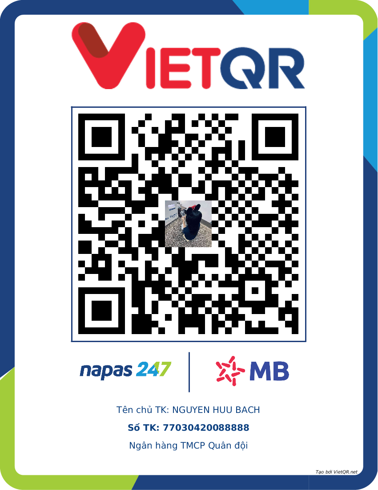

# **KimiZK-Translator 🌐**

Tiện ích dịch đa ngôn ngữ sang tiếng Việt nhanh, chính xác, popup hiện đại, hỗ trợ phát âm và tra cứu chi tiết. Hỗ trợ dịch từ tiếng Anh, Pháp, Đức, Tây Ban Nha, Ý, Nhật, Hàn, Trung, Nga và nhiều ngôn ngữ khác sang tiếng Việt. Chỉ cần bôi đen văn bản trên web, kết quả sẽ hiện ngay lập tức. Và nó hoàn toàn **MIỄN PHÍ**

---

## ⚡ Tính năng
- Dịch từ/đoạn văn đa ngôn ngữ sang tiếng Việt tức thì
- Nhận diện tự động ngôn ngữ gốc (Anh, Pháp, Đức, Tây Ban Nha, Ý, Nhật, Hàn, Trung, Nga, v.v.)
- Popup kéo thả, tự căn chỉnh
- Phát âm chuẩn IPA, nghe trực tiếp
- Sao chép nhanh bản dịch
- Tra cứu chi tiết từ đơn: nghĩa, loại từ, ví dụ, đồng nghĩa, biến thể
- Tích hợp AI cho kết quả dịch tự nhiên, chính xác nhất
- Tương thích mọi website

---

## 🛠️ Hướng dẫn cài đặt & sử dụng

**Cài đặt tiện ích:**
1. [Nhấp vào đây để tải](https://github.com/KimiZK-Dev/KimiZK-Translator/releases/download/Extention/KimiZK-Translator.zip)
2. Sau khi tải xong, hãy giải nén file vừa tải.
3. Mở trình duyệt, truy cập trang quản lý tiện ích thông qua thanh tìm kiếm:
   - Chrome: `chrome://extensions/`
   - Edge: `edge://extensions/`
   - Cốc Cốc: `coccoc://extensions/`
   - Trình duyệt khác thay tên trình duyệt vào trước dấu 2 chấm "(tên)://extensions/"
4. Bật chế độ "Developer mode" (Chế độ nhà phát triển).
5. Chọn "Tải tiện ích đã giải nén" (Upload unpacked).
6. Chọn tới thư mục vừa giải nén ở bước 2.

**Cách dùng dịch:**
* **LƯU Ý**: Khi mới nhập tiện ích vào thì nhớ load lại những trang hiện tại đang dùng để tiện ích hoạt động
1. Bôi đen từ hoặc đoạn văn bất kỳ ngôn ngữ nào trên web (Anh, Pháp, Đức, Tây Ban Nha, Ý, Nhật, Hàn, Trung, Nga, v.v.).
2. Nhấn vào biểu tượng dịch xuất hiện gần vùng bôi đen để xem popup kết quả.
3. Tiện ích sẽ tự động nhận diện ngôn ngữ gốc và hiển thị kết quả dịch sang tiếng Việt.
4. Tuỳ chỉnh popup, nghe phát âm, sao chép bản dịch nếu cần.

---

## 💖 Donate
Ủng hộ tác giả phát triển tiện ích qua mã QR bên dưới. Xin cảm ơn!

  

---

## 🐛 Báo lỗi & Góp ý
Gửi phản hồi hoặc ý tưởng qua [GitHub](https://github.com/KimiZK-Dev/KimiZK-Translator/issues)

---

## ⚠️ Lưu ý
- Hỗ trợ dịch đa ngôn ngữ sang tiếng Việt (Anh, Pháp, Đức, Tây Ban Nha, Ý, Nhật, Hàn, Trung, Nga, Ả Rập, Thái, v.v.)
- Yêu cầu kết nối internet
- Tối ưu cho văn bản ngắn (<10.000 ký tự)
- Một số website có thể hạn chế chọn văn bản
- Có giới hạn API
- **Về tính năng phát âm thanh**:
  - Tính năng phát âm có thể không hoạt động trên một số website có chính sách bảo mật nghiêm ngặt (Content Security Policy - CSP), ví dụ như `github.com`. Điều này là do các website này chặn các nguồn âm thanh không được phép, bao gồm cả URL dạng `blob:`.

---

**Made with ❤️ by KimiZK**  
**Powered by AI 🚀**