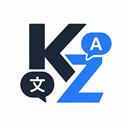
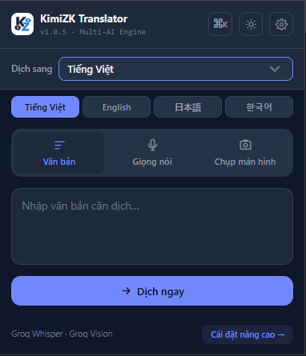
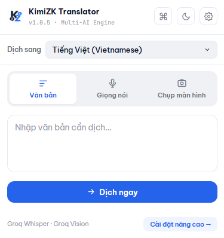
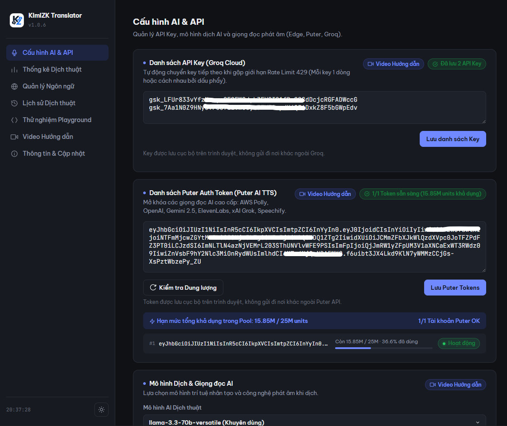
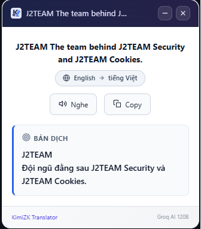
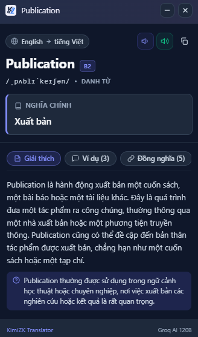

<div align="center">

  

  # KimiZK Translator

  **Tiện ích dịch thuật đa ngôn ngữ thông minh trên Chrome với Multi-AI Engine, Edge Neural TTS & Vision OCR**

  [](https://developer.chrome.com/docs/extensions/mv3/intro/)
  [](https://github.com/KimiZK-Dev/KimiZK-Translator/releases)
  [](LICENSE)
  [](#-tương-thích)

</div>

---

## 📌 Tổng quan

**KimiZK Translator** là một tiện ích Chrome Extension hiện đại giúp bạn dịch thuật văn bản, tra cứu từ vựng, phát âm chuẩn AI và trích xuất chữ từ hình ảnh trực tiếp trên trình duyệt. Tiện ích được thiết kế theo phong cách tối giản, phản hồi nhanh và tích hợp nhiều lớp AI dự phòng (Failover Engine) để đảm bảo không bị gián đoạn khi sử dụng.

---

## 🖼️ Giao diện Tiện ích (Popup Interface)

Hỗ trợ 3 chế độ dịch chính (**Văn bản**, **Giọng nói STT**, **Chụp màn hình OCR**) và tích hợp nút chuyển đổi giao diện Sáng / Tối động:

<div align="center">
  
  
  <p><em>Popup Tiện ích: Chế độ Tối (Dark Mode) và Chế độ Sáng (Light Mode)</em></p>
</div>

---

## ⚙️ Trang Cấu hình (Options Dashboard)

Trung tâm cài đặt nâng cao cho phép quản lý danh sách API Key dự phòng (Multi-Key Pool), cấp quyền micro 1-Click, tùy chọn mô hình AI và nhà cung cấp giọng đọc TTS:

<div align="center">
  
  <p><em>Giao diện Cấu hình AI & API với tính năng Multi-Key Pool tự động chuyển key khi lỗi 429</em></p>
</div>

---

## 🔍 Cửa sổ Dịch nổi (Translation Popup)

Tự động xuất hiện khi bôi đen văn bản hoặc bấm phím tắt dịch trên trang web. Hỗ trợ dịch câu văn ngữ cảnh và tra cứu từ điển chuyên sâu kèm loại từ, giải thích & ví dụ:

<div align="center">
  
  
  <p><em>Cửa sổ Dịch nổi: Dịch câu văn ngắn/dài (Trái) & Phân tích từ điển chi tiết (Phải)</em></p>
</div>

---

## ✨ Tính năng nổi bật

### 1. Multi-AI Translation Engine
- **Mô hình AI đa dạng**: Tích hợp các mô hình ngôn ngữ thế hệ mới như `llama-3.3-70b-versatile`, `qwen3.6-27b` và `groq/compound-mini`.
- **Phân tích nghĩa chuyên sâu**: Hiển thị loại từ (Danh từ, Động từ, Tính từ...), giải thích ngữ cảnh chi tiết và ví dụ thực tế.

### 2. Hệ thống Âm thanh Đa tầng (Multi-Provider TTS)
- **Microsoft Edge Neural AI (Mặc định)**: Giọng đọc tự nhiên, chuẩn bản ngữ (Hoài My, Nam Minh, Ava, Andrew, Nanami, Sun-Hi...) hoàn toàn miễn phí mà không cần API Key.
- **Puter AI Cloud TTS**: Hỗ trợ 6 nhà cung cấp giọng đọc cao cấp (AWS Polly, OpenAI TTS, Google Gemini TTS, ElevenLabs, xAI Grok, Speechify) thông qua Puter Auth Token.
- **Groq Orpheus AI TTS**: Giọng đọc phát âm truyền cảm cho tiếng Anh và tiếng Ả Rập.

### 3. Tự động dự phòng API Key (Multi-Key Pool)
- Nhập danh sách nhiều Groq API Key trong cài đặt. Khi một key chạm giới hạn lượt dùng (Rate Limit HTTP 429), hệ thống tự động chuyển sang key tiếp theo mà không làm gián đoạn việc dịch.

### 4. Thu âm Giọng nói (Whisper STT) & Chụp ảnh màn hình (Vision OCR)
- **Voice STT**: Thu âm trực tiếp từ micro và chuyển đổi thành văn bản dịch bằng `whisper-large-v3-turbo`.
- **Screen OCR**: Khoanh vùng vùng ảnh bất kỳ trên trang web để trích xuất văn bản và dịch nghĩa tức thì.

### 5. Điều khiển nhanh & Giao diện Linh hoạt
- **Command Palette (`Ctrl + K` / `Cmd + K`)**: Bảng điều khiển lệnh nhanh kiểu Raycast / Spotlight.
- **Theme Động**: Đổi giao diện Sáng / Tối với biểu tượng Mặt Trời ☀️ / Mặt Trăng 🌙 biến đổi theo trạng thái.

---

## ⌨️ Phím tắt mặc định

| Phím tắt | Thao tác |
|---|---|
| **`Ctrl + Shift + L`** (hoặc `Cmd + Shift + L`) | Dịch văn bản bôi đen trên trang web |
| **`Ctrl + K`** (hoặc `Cmd + K`) | Mở bảng lệnh nhanh Command Palette |
| **`Escape`** | Đóng nhanh popup dịch hoặc bảng lệnh |

---

## 🛠️ Hướng dẫn Cài đặt

1. **Tải mã nguồn**:
   ```bash
   git clone https://github.com/KimiZK-Dev/KimiZK-Translator.git
   ```
2. **Cài đặt vào trình duyệt**:
   - Truy cập `chrome://extensions/` trên Chrome, Edge, Brave hoặc Cốc Cốc.
   - Bật **Chế độ dành cho nhà phát triển (Developer mode)** ở góc trên bên phải.
   - Bấm **Tải tiện ích đã giải nén (Load unpacked)** và chọn thư mục `KimiZK-Translator`.
3. **Cấu hình API**:
   - Nhấp vào biểu tượng KimiZK Translator ➔ Mở **Cài đặt** ➔ Nhập API Key từ [Groq Console](https://console.groq.com/) (miễn phí).

---

## 🛡️ Tương thích & Bảo mật

- **Tương thích**: Chrome, Microsoft Edge, Brave, Cốc Cốc.
- **Bảo mật dữ liệu**: API Key và các thiết lập cá nhân được lưu trữ cục bộ trong `chrome.storage.local`. Không có dữ liệu nào bị gửi về máy chủ bên thứ ba không xác định.

---

## 📝 Giấy phép

Dự án được phát hành theo giấy phép [MIT License](LICENSE).

## 📞 Thông tin Tác giả

- **Tác giả / Organization**: [KimiZK-Dev](https://github.com/KimiZK-Dev)
- **Facebook Support**: [NgHxBach](https://www.facebook.com/NgHxBach)